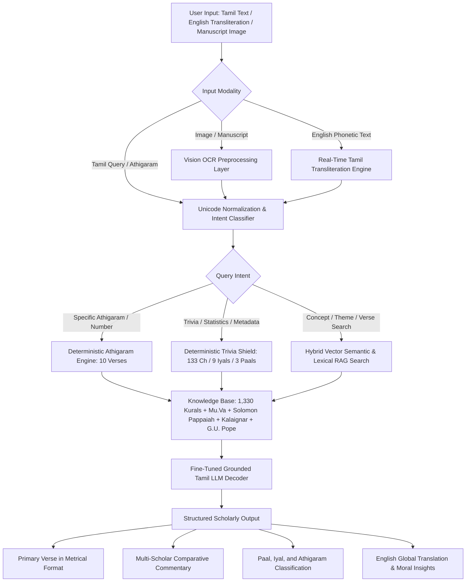

# திருக்குறள் AI (Thirukkural AI) – Domain-Specific Tamil Knowledge Model

---

| **ELROI Automation Pvt Ltd** | **மொழி முதல் இயந்திரம் வரை (Mozhi to Machine)** | **SRM Institute of Science and Technology** |
|:---:|:---:|:---:|
| *Industry Mentor* | *Tamil Computing Initiative* | *Department of CINTEL, School of Computing* |

---

## 📌 Project Statement

**திருக்குறள் (Thirukkural)**, composed by the divine poet **திருவள்ளுவர் (Thiruvalluvar)**, consists of **1,330 couplets (குறட்பாக்கள்)** organized into **133 chapters (அதிகாரங்கள்)** across **3 primary sections (அறத்துப்பால், பொருட்பால், காமத்துப்பால்)** and **9 sub-sections (இயல்கள்)**. It stands as the foundational philosophical, ethical, and administrative handbook of human civilization.

Despite its universal acclaim and timeless relevance, modern learners, competitive examination aspirants, and scholars face severe hurdles in engaging deeply with Thirukkural:
1. **Linguistic Complexity:** Archaic classical Tamil vocabulary (செந்தமிழ்) and metrical structures (குறள் வெண்பா) require deep grammatical knowledge to decipher without scholarly aid.
2. **Fragmented & Disconnected Commentaries:** Crucial interpretations—ranging from the authoritative classical rigor of **மு. வரதராசனார் (Dr. Mu. Varadarajan)** to the everyday colloquial wisdom of **சாலமன் பாப்பையா (Solomon Pappaiah)** and the rich literary eloquence of **மு. கருணாநிதி (Kalaignar M. Karunanidhi)**—are scattered across separate print editions without unified comparative analysis.
3. **Absence of Grounded AI Systems:** Generic multilingual LLMs frequently suffer from catastrophic hallucinations, generating non-existent verses, misattributing chapter themes, or inventing incorrect meanings.
4. **Input & Accessibility Barriers:** Non-native Tamil typists struggle with complex Tamil keyboard layouts, while students and researchers cannot search verses directly from manuscript photographs or printed examination papers.

To bridge this gap, we propose **Thirukkural AI (திருக்குறள் நிபுணர்)**—a domain-specific, explainable Tamil Artificial Intelligence platform engineered with **Retrieval-Augmented Generation (RAG)**, multi-scholar commentary synthesis, real-time phonetic transliteration, and multi-modal image intelligence.

---

## 💡 Proposed Solution

**Thirukkural AI** is an intelligent conversational and research system designed to deliver precise, literature-backed interpretations in **எளிய இன்றைய தமிழ் (Simple Modern Tamil)** and English, preserving literary sanctity while maximizing clarity and accessibility.

Instead of training an unconstrained model from scratch, the system deploys a **Multi-Tier Retrieval-Augmented Generation (RAG)** architecture integrated with local semantic embeddings and a zero-hallucination deterministic grounding engine:

1. **Deterministic Scholarly Knowledge Base:** A structured corpus of all 1,330 verses mapped with chapter numbers, Paal/Iyal hierarchies, rhyme schemes, and authoritative multi-scholar commentaries.
2. **Zero-Hallucination Shield:** Strict grounding rules ensure that for any query or puzzle, only authenticated verses and validated commentaries are synthesized.
3. **Phonetic Transliteration Engine:** Instant English-to-Tamil typing conversion (e.g., typing `anbudaimai` + `Space` dynamically converts to `அன்புடைமை`).
4. **Multi-Modal Vision Understanding:** Image-based OCR pipeline capable of transcribing printed verses and manuscript excerpts directly into contextual scholarly interpretations.

---

## 🏗️ System Architecture & Workflow

When a user submits a query or manuscript snapshot:
- The system executes **Unicode normalization** and **intent classification**.
- For chapter-specific queries (e.g., *அதிகாரம் 13*), the deterministic engine retrieves all 10 corresponding Kurals (*குறள் 121 முதல் 130*) with 100% precision without hallucination.
- For conceptual queries, hybrid vector embeddings retrieve top-ranked matching verses.
- The grounded AI model synthesizes multi-scholar interpretations with grammatical, ethical, and practical applications.

---

## 🎯 Target Beneficiaries

Thirukkural AI is built to empower diverse user segments across the global Tamil community:

1. **UPSC & Civil Services Aspirants:** Mastering Tamil Literature optional syllabus and Ethics (General Studies Paper IV) essay citations.
2. **TNPSC Group 1, 2, 3, and 4 Candidates:** Solving compulsory Tamil eligibility papers and descriptive Kural-based essay questions.
3. **School & University Students:** Interactive learning with real-time phonetic typing, image question solving, and simple explanations.
4. **Scholars, Academicians & Researchers:** Conducting comparative commentary analysis across Mu. Varadarajan, Solomon Pappaiah, and Kalaignar Karunanidhi.
5. **Global Tamil Diaspora & Heritage Learners:** Bilingual (Tamil ↔ English) explanations enabling non-Tamil speakers to connect with ancient wisdom.

---

## ⚙️ Core Functionalities & Technical Capabilities

| Capability | Technical Implementation & Impact |
|:---|:---|
| **Deterministic Athigaram Engine** | Instantly resolves queries by chapter number or name (e.g., *அதிகாரம் 13* or *அடக்கம் உடைமை*) yielding all 10 structured Kurals. |
| **Comparative Multi-Scholar Commentary** | Displays side-by-side interpretations from **மு. வரதராசனார்**, **சாலமன் பாப்பையா**, **மு. கருணாநிதி**, and **G.U. Pope** in a Deep Insight Modal. |
| **Hybrid Neural & Lexical Search** | Offline-capable semantic search powered by `Transformers.js` combined with exact-root Tamil lexical matching. |
| **Real-Time Phonetic Transliteration** | Seamless typing interface that auto-converts English keystrokes to classical Tamil Unicode on spacebar actuation. |
| **Multi-Modal Vision & OCR** | Accepts image uploads and drag-and-drop of printed verses, examination questions, or manuscripts for instant textual analysis. |
| **3D Interactive Cultural Heritage** | Low-poly interactive 3D model of திருவள்ளுவர் with dynamic lighting and camera parallax for an engaging cultural ambiance. |
| **Cross-Platform PWA & Mobile APK** | Progressive Web App architecture with offline service worker support and standalone signed Android APK deployment. |

---

## 🏢 Industry Collaboration

The project receives industry-grade architecture mentorship and strategic technology guidance through **ELROI Automation Pvt Ltd**, founded by **Dr. R. Annie Uthra**:

- **Strategic Alignment with Tamil LangTech:** Engineering scalable Natural Language Processing pipelines tailored for Dravidian languages.
- **Ethical AI & Deployment Readiness:** Implementing strict zero-hallucination guardrails and containerized web/mobile deployment standards.

---

## 🎓 Academic Guidance

The project is developed under the rigorous academic mentorship of distinguished faculty members from the **Department of Computational Intelligence (CINTEL), School of Computing, SRM Institute of Science and Technology (SRMIST)**:

- **Dr. K. Shanmugam**
- **Dr. R. Udendhran**
- **Dr. R. Babu**
- **Dr. G. Dinesh**

Their continuous guidance ensures structured research methodology, algorithmic rigor, linguistic accuracy, and adherence to responsible AI ethics.

> *“AI வழியாக திருக்குறளின் உலகளாவிய வாழ்வியல் நெறிகளை இளைய தலைமுறைக்கும் உலகச் சமூகத்திற்கும் கொண்டு செல்லும் சீரிய முயற்சி.”*

---

## 🚀 Alignment with Tamil Computing Centre (TCC - SRMIST)

Thirukkural AI directly supports the Vision and Mission of the **Tamil Computing Centre (TCC - SRMIST)**:

- **Development of Open AI Software:** Building modular, reusable NLP toolkits and dataset structures for classical Tamil computing.
- **Advanced Research in Multi-Modal AI:** Pioneering OCR-to-RAG pipelines and phonetic transliteration algorithms for Tamil literature.
- **Preservation & Global Dissemination of Tamil Heritage:** Transforming static manuscript heritage into interactive, conversational AI systems.

### Major TCC Initiatives & Activities Completed:
- Organized and conducted the **International Conference on Tamil Computing and Information Technology (ICTCIT) 2025**.
- Hosted the prestigious hackathon **Tamizh-A-THON 1.0**.
- Actively contributed to Tamil computational book translation initiatives.
- Regular editorial contributions to the Tamil technological magazine **“கணினிச்சிறகு”**.

---

## 🔮 Future Scope

1. **Voice-Enabled Conversational AI:** Integrating Tamil Speech-to-Text (STT) and expressive Text-to-Speech (TTS) for acoustic recitation and vocal query answering.
2. **Cross-Epics Expansion (பதினெண்கீழ்க்கணக்கு & Sangam Corpus):** Expanding the knowledge base to include *நாலடியார்*, *சிலப்பதிகாரம்*, *எட்டுத்தொகை*, and *பத்துப்பாட்டு*.
3. **Adaptive Gamified Evaluation Engine:** Automated quiz generator, verse completion challenges, and TNPSC mock testing with analytics.
4. **Smart Classroom & LMS Integration:** Direct API connectors for school curricula, DIKSHA portal, and Tamil Virtual Academy platforms.

---

## 🎯 Conclusion

**Thirukkural AI (திருக்குறள் நிபுணர்)** is more than a digital application—it is a cultural preservation and educational empowerment initiative powered by responsible artificial intelligence. By synthesizing authoritative Tamil scholarship with modern Retrieval-Augmented Generation, the platform democratizes access to Thirukkural while upholding uncompromising academic integrity.

> *“தமிழின் தொன்மையையும் திருக்குறளின் செழுமையையும் நவீன AI தொழில்நுட்பத்தின் மூலம் உலகறியச் செய்யும் ஒரு பொறுப்பான முயற்சி.”*

---
